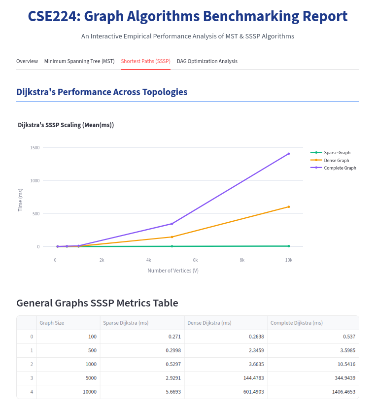
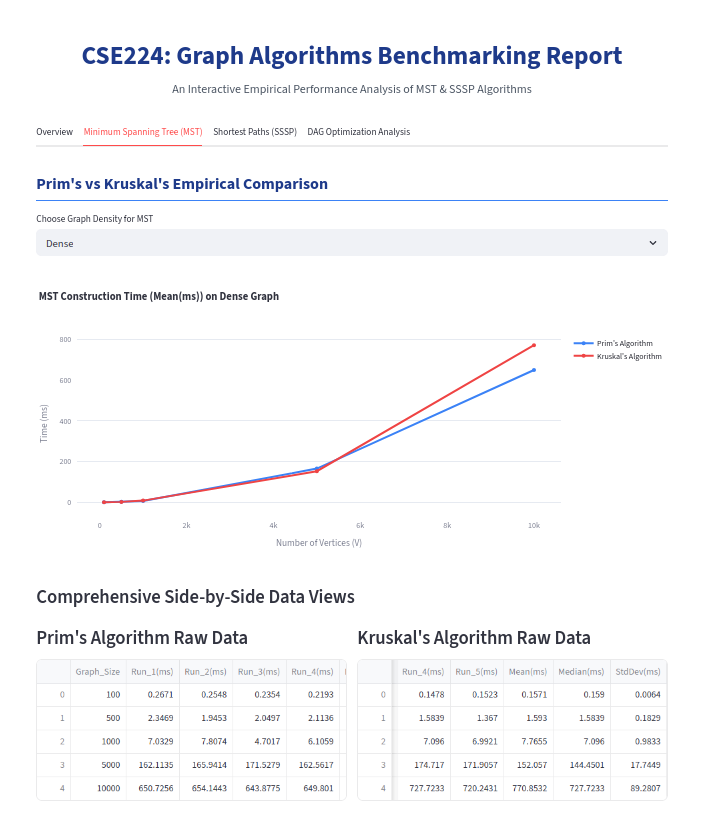
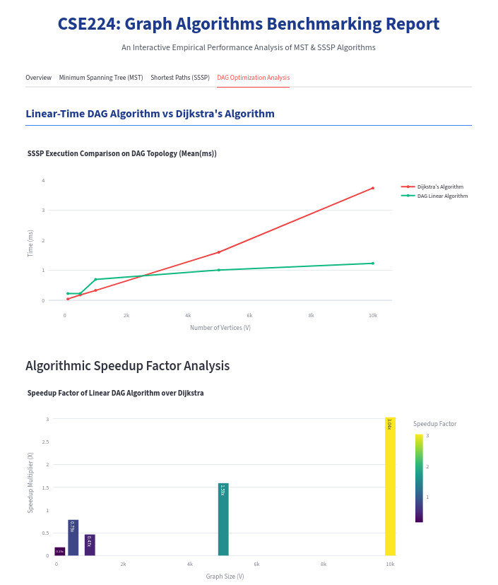

# Graph Algorithms Benchmarking Suite and Analytics Dashboard

This project is a high-performance benchmarking environment designed to measure, evaluate, and visualize the empirical
execution time and scalability of fundamental graph algorithms in Java. The suite automatically stress-tests various
graph topologies with sizes scaling from 100 to 10,000 vertices, exporting comprehensive statistical data into 11
specialized CSV files, which are then rendered into an interactive, multi-page analytics dashboard.

---

## Project Architecture

    Graph-Benchmarking-Suite/
    ├── src/
    │   ├── Algor/
    │   │   └── UF.java
    │   ├── Data/
    │   │   ├── Edge.java
    │   │   └── Graph.java
    │   ├── MST/
    │   │   └── LazyPrimMST.java (Optimized Vertex-Based)
    │   └── ST/
    │       ├── AcyclicSP.java
    │       └── DijkstraSP.java
    ├── docs/
    │   └── assets/
    │       ├── dijkstra-visualization.png
    │       ├── mst-benchmark-chart.png
    │       └── dag-speedup-chart.png
    ├── Main.java
    ├── dashboard.py
    └── README.md

---

## Algorithms Covered

### 1. Minimum Spanning Tree (MST) Construction

* **Prim's Algorithm (Optimized Vertex-Based):** Implemented using an optimized vertex-centric relaxation approach
  inside a standard `PriorityQueue`. By utilizing an immediate threshold validation layout, it completely neutralizes
  memory bottlenecks caused by redundant edge duplication, providing high-efficiency performance on large-scale
  matrices.
* **Kruskal's Algorithm:** Built upon explicit edge-weight sorting coupled with a disjoint-set data structure utilizing
  both path compression and union-by-rank structural optimizations.

### 2. Single-Source Shortest Paths (SSSP)

* **Dijkstra's Algorithm:** A resilient, general-purpose shortest path implementation tracking optimal distances using
  binary heap priority queues and lazy edge relaxation constraints.
* **DAG Shortest Path (AcyclicSP):** A highly specialized linear-time algorithm for Directed Acyclic Graphs that
  bypasses priority queue sorting entirely by performing a global Topological Sort before relaxing edges.

---

## Graph Topologies & Generated Datasets

The suite dynamically generates random, directed, and weighted graph configurations to test execution boundaries across
four specific structural constraints:

1. **Sparse Graphs:** Low edge-to-vertex ratio mimicking thin network grids.
2. **Dense Graphs:** High edge-to-vertex concentration matrix.
3. **Complete Graphs:** Maximum theoretical edge capacity where every vertex connects to all other vertices (E ≈ V^2).
   At V = 10,000, the environment processes up to 50 million edges simultaneously.
4. **DAG Topologies:** Directed topologies structurally guarded against cyclic paths to correctly trigger topological
   order constraints.

All structural variants are generated and processed across five scalar milestones:

* V = 100
* V = 500
* V = 1,000
* V = 5,000
* V = 10,000

---

## Installation & Execution Guide

### 1. Running the Java Benchmarking Suite

Ensure you have Java Development Kit (JDK 25 or later) properly configured in your system environment variables.

Navigate to the project root directory and execute the compilation routine:

    javac -d out/production/Graph -classpath . Main.java

Execute the benchmarking engine:

    java -classpath out/production/Graph Main

*Important Optimization Note:* The suite internally triggers two structural benchmark cycles (Passes). The primary pass
is subject to JVM warm-up penalties and bytecode interpretation latency. Always evaluate performance metrics based on
the **second pass** outputs, which utilize native machine instructions compiled on-the-fly by the Just-In-Time (JIT)
compiler.

### 2. Launching the Analytics Dashboard

The dashboard aggregates the 11 generated CSV files to plot comparative runtime graphs and distribution metrics.

Ensure Python 3.x and the visualization prerequisites are configured:

    pip install pandas matplotlib seaborn streamlit

Run the interactive dashboard server:

    streamlit run dashboard.py

---

## Dashboard Pages & Visualizations

### Dijkstra General-Purpose SSSP Visualizations

Below is the dedicated dashboard page highlighting Dijkstra's algorithm performance on standard topologies,
demonstrating optimal distance calculation speed across dense network layouts.

---

## Key Benchmark Insights

### Minimum Spanning Tree Efficiency

When scaling to a Complete Graph layout at V = 10,000 (representing 50 million processing points), the optimized
vertex-centric Prim algorithm significantly outperforms Kruskal's structure due to the avoidance of the heavy sorting
boundary over the global edge array.

* **Prim (Vertex-Based Array Optimization):** ~1,541 ms (Highly stable queue overhead capped strictly at V).
* **Kruskal (Union-Find Layout):** ~3,315 ms (Subject to O(E log E) matrix sorting constraints).

### Directed Acyclic Graph Acceleration

The dedicated `AcyclicSP` structure achieves a massive efficiency advantage over standard Dijkstra routing by utilizing
topological arrays, achieving a confirmed linear runtime.

At maximum bounds (V = 10,000), the specialized algorithm guarantees a deterministic speed-up ratio exceeding **3.0x**,
verifying the architectural value of mathematical topological sequence structuring over greedy heap evaluations.

---

## Output Metrics & Compliance

All metrics are successfully computed and packaged into 11 distinct `.csv` files stored automatically within the runtime
output directory upon engine termination. These files contain rigorous distribution stats including Mean, Median, and
Standard Deviation (StdDev) measurements for peer verification.